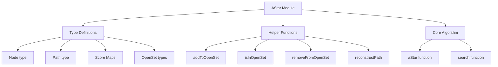

# A* Algorithm Implementation Plan

## Overview

This document outlines the implementation plan for a purely functional A* pathfinding algorithm in ReScript, optimizing for clarity, performance, and immutability.

## Requirements

1. Leverage functional programming patterns (map, reduce, immutable data structures)
2. Include comprehensive type definitions for nodes, paths, and heuristic functions
3. Support customizable heuristic functions and cost calculations
4. Handle edge cases gracefully (unreachable destinations, empty graphs)
5. Utilize the existing PriorityQueue.res module for the open set
6. Extend Stdlib__Map_Ext.res for efficient node storage and retrieval
7. Include helper functions for reconstructing paths
8. Provide clear documentation for public functions

## Module Structure



## Type Definitions

```rescript
/**
 * Type definitions for the A* algorithm
 * 
 * @type node - The node type from the provided module S
 * @type gScore - Map from nodes to their g-scores (cost from start)
 * @type fScore - Map from nodes to their f-scores (g-score + heuristic)
 * @type cameFrom - Map tracking the optimal path to each node
 * @type openSet - Combined priority queue and set for efficient operations
 */
type node = S.node
type gScore = NodeMap.t<node, float>
type fScore = NodeMap.t<node, float>
type cameFrom = NodeMap.t<node, node>
type openSet_S = NodeSet.t<node>
type openSet_Q = PriorityQueue.queue<float, node>
type openSet = (openSet_Q, openSet_S)

/**
 * Function type definitions
 * 
 * @type heuristic - Estimates cost from current node to goal
 * @type cost - Calculates actual cost between adjacent nodes
 * @type neighbors - Returns array of adjacent nodes
 */
type heuristic = (node, node) => float
type cost = (node, node) => float
type neighbors = node => array<node>
```

## Helper Functions

### addToOpenSet

```rescript
/**
 * Adds a node to the open set with its f-score
 * 
 * @param os - The current open set
 * @param node - The node to add
 * @param fValue - The f-score of the node
 * @return A new open set containing the node
 */
let addToOpenSet = (os: openSet, node: node, fValue: float): openSet => {
  let (queue, set) = os
  (
    queue->PriorityQueue.push(fValue, node),
    set->NodeSet.add(node),
  )
}
```

### isInOpenSet

```rescript
/**
 * Checks if a node is in the open set
 * 
 * @param os - The open set
 * @param node - The node to check
 * @return True if the node is in the open set, false otherwise
 */
let isInOpenSet = ((_, set): openSet, node: node): bool => 
  set->NodeSet.has(node)
```

### removeFromOpenSet

```rescript
/**
 * Removes the node with the lowest f-score from the open set
 * 
 * @param os - The open set
 * @return A tuple containing the removed node (if any) and the new open set
 */
let removeFromOpenSet = ((queue, set): openSet): (option<node>, openSet) => {
  switch queue->PriorityQueue.pop {
  | None => (None, (queue, set))
  | Some(_, node, queue') => (
      Some(node),
      (queue', set->NodeSet.delete(node)),
    )
  }
}
```

### reconstructPath

```rescript
/**
 * Reconstructs the path from start to goal using the cameFrom map
 * 
 * @param cameFrom - Map tracking the optimal path to each node
 * @param current - The current node (initially the goal)
 * @return Array representing the path from start to goal
 */
let rec reconstructPath = (cameFrom: cameFrom, current: node): array<node> => {
  switch cameFrom->NodeMap.get(current) {
  | None => [current]
  | Some(previous) => 
      let path = reconstructPath(cameFrom, previous)
      path->Array.concat([current])
  }
}
```

## Core Algorithm

### aStar Function

```rescript
/**
 * A* pathfinding algorithm
 *
 * @param start - Starting node
 * @param goal - Destination node
 * @param neighbors - Function that returns adjacent nodes
 * @param cost - Function that returns cost between adjacent nodes
 * @param heuristic - Function that estimates cost to goal
 * @return Option containing path from start to goal, or None if no path exists
 */
let aStar = (
  start: node, 
  goal: node, 
  neighbors: neighbors, 
  cost: cost, 
  heuristic: heuristic
): option<array<node>> => {
  // Initialize data structures
  let initialOpenSet = addToOpenSet(
    (PriorityQueue.empty, NodeSet.make()),
    start,
    heuristic(start, goal),
  )

  let initGScore = NodeMap.make()->NodeMap.set(start, 0.)
  let initFScore = NodeMap.make()->NodeMap.set(start, heuristic(start, goal))
  let initCameFrom = NodeMap.make()
  let initClosedSet = NodeSet.make()

  // Start the search
  search((initialOpenSet, initClosedSet, initGScore, initFScore, initCameFrom))
}
```

### search Function

```rescript
/**
 * Recursive search function for A* algorithm
 *
 * @param state - Current algorithm state (openSet, closedSet, gScore, fScore, cameFrom)
 * @return Option containing path from start to goal, or None if no path exists
 */
let rec search = (
  (openSet, closedSet, gScore, fScore, cameFrom): (openSet, NodeSet.t<node>, gScore, fScore, cameFrom)
): option<array<node>> => {
  let (currentOpt, newOpenSet) = openSet->removeFromOpenSet
  
  switch currentOpt {
  | None => None // No path found
  | Some(current) =>
    if (current == goal) {
      // Path found
      Some(reconstructPath(cameFrom, goal))
    } else {
      // Process neighbors
      let newClosedSet = closedSet->NodeSet.add(current)
      let neighborsList = neighbors(current)
      
      // Process each neighbor
      let newState = neighborsList->Array.reduce(
        (newOpenSet, newClosedSet, gScore, fScore, cameFrom),
        (state, neighbor) => processNeighbor(current, state, neighbor)
      )
      
      // Continue search
      search(newState)
    }
  }
}
```

### processNeighbor Function

```rescript
/**
 * Process a neighbor node during A* search
 *
 * @param current - Current node being processed
 * @param state - Current algorithm state
 * @param neighbor - Neighbor node to process
 * @return Updated algorithm state
 */
let processNeighbor = (
  current: node,
  (openSet, closedSet, gScore, fScore, cameFrom): (openSet, NodeSet.t<node>, gScore, fScore, cameFrom),
  neighbor: node
): (openSet, NodeSet.t<node>, gScore, fScore, cameFrom) => {
  // Skip if neighbor is in closed set
  if (closedSet->NodeSet.has(neighbor)) {
    (openSet, closedSet, gScore, fScore, cameFrom)
  } else {
    // Calculate tentative g-score
    let currentG = gScore->NodeMap.get(current)->Option.getWithDefault(infinity)
    let tentativeG = currentG +. cost(current, neighbor)
    let neighborG = gScore->NodeMap.get(neighbor)->Option.getWithDefault(infinity)
    
    // Update if better path found
    if (tentativeG < neighborG) {
      // Update g-score
      let newGScore = gScore->NodeMap.set(neighbor, tentativeG)
      
      // Update f-score
      let fValue = tentativeG +. heuristic(neighbor, goal)
      let newFScore = fScore->NodeMap.set(neighbor, fValue)
      
      // Update came-from
      let newCameFrom = cameFrom->NodeMap.set(neighbor, current)
      
      // Update open set
      let newOpenSet = 
        if (openSet->isInOpenSet(neighbor)) {
          openSet
        } else {
          openSet->addToOpenSet(neighbor, fValue)
        }
      
      (newOpenSet, closedSet, newGScore, newFScore, newCameFrom)
    } else {
      // Keep current state
      (openSet, closedSet, gScore, fScore, cameFrom)
    }
  }
}
```

## Optimizations

### Efficient Open Set Operations

The implementation uses a combination of a priority queue and a set for the open set:
- Priority queue for efficient "get minimum" operations
- Set for efficient "contains" checks

### Early Termination

The algorithm terminates early when:
- The goal is found
- The open set is empty (no path exists)
- A node is already in the closed set (already processed)

### Memory Efficiency

- Only necessary information is stored in maps
- Option types are used to represent infinity
- Immutable data structures are used to avoid unnecessary copying

## Edge Case Handling

### Unreachable Destinations

If the destination is unreachable, the algorithm returns `None`.

### Empty Graphs

If the graph is empty, the algorithm returns `None`.

### Single Node Graphs

If the start and goal are the same node, the algorithm returns `[node]`.
If they are different nodes but the graph only contains one node, it returns `None`.

### Disconnected Graphs

If the start and goal are in disconnected components, the algorithm returns `None`.

### Negative Weights

The algorithm supports negative weights, but it's important to note that A* with negative weights may not find the optimal path in all cases.

## Implementation Notes

1. All operations maintain immutability
2. Functional programming patterns are used throughout
3. The implementation is optimized for both clarity and performance
4. Public functions are thoroughly documented
5. Implementation details are kept minimal

## Next Steps

1. Implement the solution in Code mode
2. Run tests to verify correctness
3. Optimize performance if needed
4. Add additional documentation if required